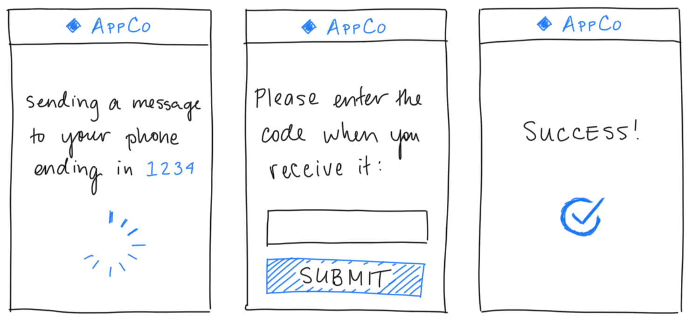
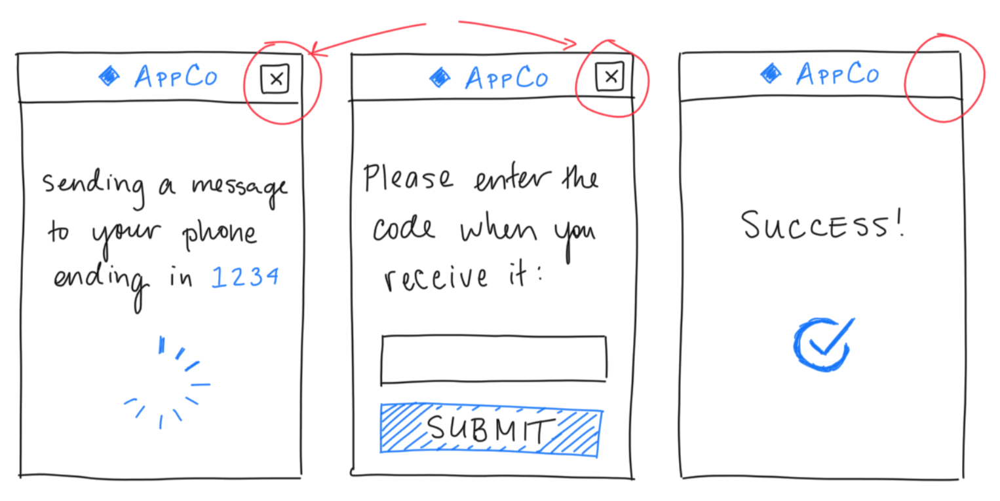
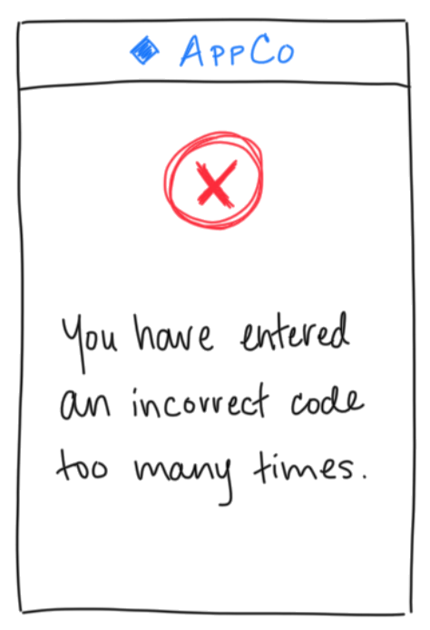

# Union types are Powerful!


## Union Types: An Example

```js
type A = 'A'
type B = 'B'
type AorB = A | B;

const whichBranch = (x: AorB): string => {
  switch (x.tag) {
    case 'A':
      return "In branch A";
    case 'B':
      return "In branch B";
    default:
      (x.tag: empty);
      throw new Error('impossible');
  }
}
```

# Union types in Flow have a cost :(


## Outline

- Set up a problem that union types can solve

- Further motivate **why** we want union types

- Examine the cost of union types in Flow

- Show how Reason avoids this cost

- Bonus: compare other compile-to-JS languages


## Union Types in a React Component

Consider a simple two-factor authentication modal:

\


## We can model this with a union type

```js
type Screen =
  | 'LoadingScreen'
  | 'CodeEntryScreen'
  | 'SuccessScreen';
```

Benefits to using a union type:

- Documentation in the types
- Developers (and our compiler) immediately know:\
  "These are **all** the cases."
- Flow can warn us when we've forgotten a case


## Initial Feedback? Add a "cancel" button

After showing it to our team, someone suggests adding a
cancel button:

\

In particular: no need for a cancel button on the last screen!


## `needsCancelButton`: Initial Implementation

```js
const needsCancelButton = (screen: Screen): boolean => {
  // Recall: 'SuccessScreen' is final, so it doesn't
  // make sense to have a cancel button.
  return screen !== 'SuccessScreen';
};
```

## Adding a `'FailureScreen'`

\centering

{width=33%}\


## Our Updated `Screen` Type

```js
type Screen =
  | 'LoadingScreen'
  | 'CodeEntryScreen'
  | 'SuccessScreen'
  // New case to handle too many wrong attempts:
  | 'FailureScreen';
```


## Oh no! A bug!

After changing the type, we update our code.
But in particular, say we forget to update `needsCancelButton`:

```js
const needsCancelButton = (screen: Screen): boolean => {
  return screen !== 'SuccessScreen';
};
```

When we save and run Flow... it passes!
Flow couldn't warn us that `needsCancelButton` doesn't
account for the case we added.

Thus: a silent bug! (There shouldn't be a cancel button on
`'FailureScreen'`, but there is.)


## First reaction: just fix the bug.

```js
const needsCancelButton = (screen: Screen): boolean => {
  return (
    screen !== 'SuccessScreen' ||
    screen !== 'FailureScreen'
  );
};
```

But we can do better!
Let's **prevent future bugs** from happening...


## `switch`: Taking Advantage of Exhaustiveness

```js
const needsCancelButton = (screen: Screen): boolean => {
  switch (screen) {
    case 'LoadingScreen':
      return true;
    case 'CodeEntryScreen':
      return true;
    case 'SuccessScreen':
      return false;
    default:
      // [flow]: Error: Cannot call `absurd` with
      // `screen` bound to `x` because string literal
      // `FailureScreen` is incompatible with empty
      return absurd(screen);
  }
}
```


## Takeaway: Only use union types with `switch`!

Every time we use a union **without** a `switch` statement,\
Flow **can't tell us** when we're missing something.

Always[^moderation] use `switch` statements with unions!

[^moderation]:
  Of course, use your best judgement. Sometimes you don't
  want to use a `switch`. But *know* that you're giving up
  static guarantees!


## Correctness, but at what cost?

```js
// ----- before: 62 bytes (minified) -----

const needsCancelButton = (screen) => {
  return screen !== 'SuccessScreen';
};


 
```


## Correctness, but at what cost?

```js
// ----- after: 240 bytes (minified) -----
const absurd = (x) => {
  throw new Error('This case is impossible.');
};
const needsCancelButton = (screen) => {
  switch (screen) {
    case 'LoadingScreen':
      return true;
    case 'CodeEntryScreen':
      return true;
    case 'SuccessScreen':
      return false;
    default:
      return absurd(screen);
  }
};
```


## Correctness, at the cost of bundle size!

`needsCancelButton` is a bit of a pathological case:

- Short case bodies.
- Only one case is different.
- Long-ish string constants.

But still: I've **definitely** felt the impact in the wild!


# Types and Optimizing Compilers


## Types promise better compiled code.

Proponents of types argue:

"If we write code using **higher-level abstractions**,
then compilers can do more optimizations for us."


## Flow is not a compiler

We've seen this **isn't** a promise Flow gives us.

Flow isn't a **compiler**, only a type checker.

By stripping the types, Babel / Webpack / Uglify lose access
to making potential optimizations.

In particular: we threw away the exhaustiveness guarantee!


## Enter: Reason

Reason (i.e., ReasonML) brings OCaml tools to the web.

OCaml offers:

- Mature optimizing compiler
- Wide ecosystem of packages
- **Great** type system

Reason adds:

- Tight JavaScript interop (via BuckleScript)
- Familiar syntax (looks like Flow!)


## `needsCancelButton` in Reason

```js
type screen =
  | LoadingScreen
  | CodeEntryScreen
  | SuccessScreen;

let needsCancelButton = (screen: screen): bool => {
  switch (screen) {
  | LoadingScreen => true;
  | CodeEntryScreen => true;
  | SuccessScreen => false;
  }
};
```


## Reason looks pretty familiar!

Key differences compared to Flow:

- Custom datatype, instead of abusing strings
- Replaced `case` keyword with pipe in `switch`
- Exhaustiveness by default

The `|` instead of `case` is nice:
we can copy / paste our type definition to kickstart our
`switch` statement!


## Reason's Generated Code

```js
// Generated by BUCKLESCRIPT VERSION 3.0.1
'use strict';

function needsCancelButton(status) {
  if (status !== 2) {
    return false;
  } else {
    return true;
  }
}
// ---------------------------------------
```

Entire `switch` statement optimized down to a single `if`!
`'SuccessScreen'` shortened to `2`!


## Reason's Generated Code + `uglify`

```js
"use strict";
function needsCancelButton(n){
  return !(n>=2)
}
```

Uglify can shorten it even further: no `if` statement!

This is **even better** than our hand-written implementation.

Yet, we **didn't sacrifice** safety or readability!


## Safety AND Performance

Reason's type system delivered on the promise of types in a
way Flow couldn't:

- We wrote high-level, expressive code.

- The type checker gave us strong guarantees about the
  correctness (exhaustiveness) of our code.

- The compiler translated that all to tiny, performant code.


# Bonus: Comparing Other Languages


## TypeScript

\small

```js
var Screen_; (function (Screen_) {
    Screen_[Screen_["LoadingScreen"] = 0] = "LoadingScreen";
    Screen_[Screen_["CodeEntryScreen"] = 1] = "CodeEntryScreen";
    Screen_[Screen_["SuccessScreen"] = 2] = "SuccessScreen";
})(Screen_ || (Screen_ = {}));
var impossible = function (x) {
    throw new Error('This case is impossible.');
};
var needsCancelButton = function (screen) {
    switch (screen) {
        case Screen_.LoadingScreen: return true;
        case Screen_.CodeEntryScreen: return true;
        case Screen_.SuccessScreen: return false;
        default: return impossible(screen);
    }
};
```


## PureScript

\tiny

```js
"use strict";
var LoadingScreen = (function () {
    function LoadingScreen() {};
    LoadingScreen.value = new LoadingScreen();
    return LoadingScreen;
})();
var CodeEntryScreen = (function () {
    function CodeEntryScreen() {};
    CodeEntryScreen.value = new CodeEntryScreen();
    return CodeEntryScreen;
})();
var SuccessScreen = (function () {
    function SuccessScreen() {};
    SuccessScreen.value = new SuccessScreen();
    return SuccessScreen;
})();
var needsCancelButton = function (v) {
    if (v instanceof LoadingScreen) {
        return true;
    };
    if (v instanceof CodeEntryScreen) {
        return true;
    };
    if (v instanceof SuccessScreen) {
        return false;
    };
    throw new Error("Failed pattern match at Main line 10, column 1");
};
```


## Elm

\footnotesize

```js
var _user$project$Main$needsCancelButton = function (page) {
  var _p0 = page;
  switch (_p0.ctor) {
    case 'LoadingScreen':
      return true;
    case 'CodeEntryScreen':
      return true;
    default:
      return false;
  }
};
var _user$project$Main$SuccessScreen = {ctor: 'SuccessScreen'};
var _user$project$Main$CodeEntryScreen = {ctor: 'CodeEntryScreen'};
var _user$project$Main$LoadingScreen = {ctor: 'LoadingScreen'};
```

## Further Reading

- [Case Exhaustiveness in Flow]
- [Union Types in Flow & Reason]
- [Tagged Unions in Flow]
- [Pattern Matching in Reason]

[Case Exhaustiveness in Flow]: https://blog.jez.io/flow-exhaustiveness/
[Union Types in Flow & Reason]: https://blog.jez.io/union-types-flow-reason/
[Tagged Unions in Flow]: https://flow.org/en/docs/types/unions/#toc-disjoint-unions
[Pattern Matching in Reason]: https://reasonml.github.io/docs/en/pattern-matching.html


<!-- vim:tw=60
-->
